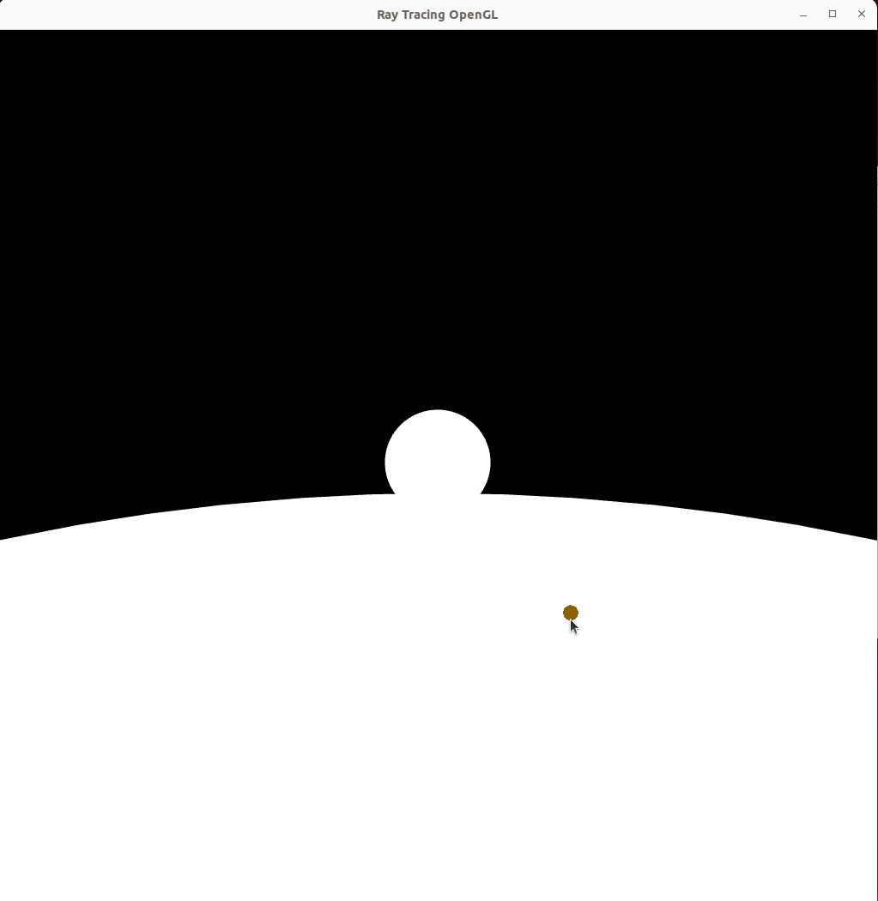
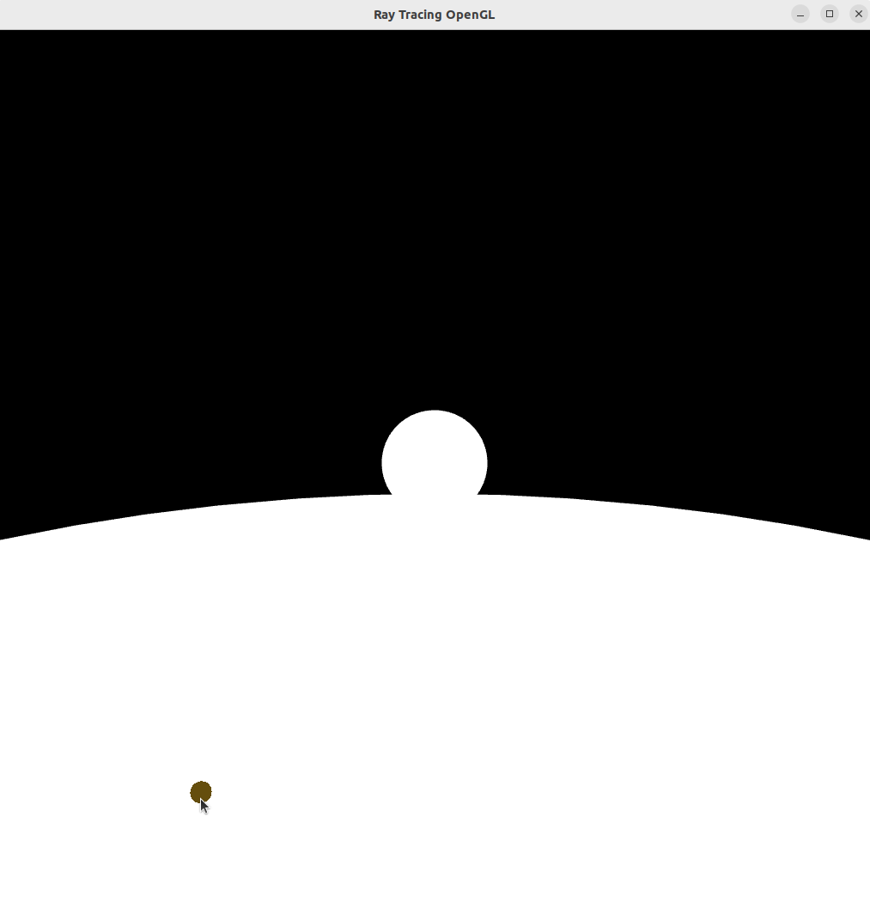

#RayTracingPolygonal

This is a sandbox for mouse pointer tracer algorithm for OpenGL.

In the scene small sphere is setting on top of the larger sphere.  Colored disk is following a mouse pointer.
-  The pointer following disk appears to be small - the pointer intersects the sphere far from viewer.  

-  The pointer following disk apperas to be bigger than in previous creenshot - it is closer to viewer.  
    
